# light2d
This project illustrates light rendering in 2D with C.

All samples output PNGs with [svpng](https://github.com/miloyip/svpng).

License: public domain.

# Basic

Use Monte Carol integration and ray marching of signed distance field (SDF) to render a emissive circle.

Source code: [basic.c](basic.c)

Uniform sampling (64 samples per pixel):

Uniform sampling with different number of samples per pixel:

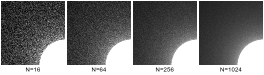

Stratified sampling (64 samples per pixel):

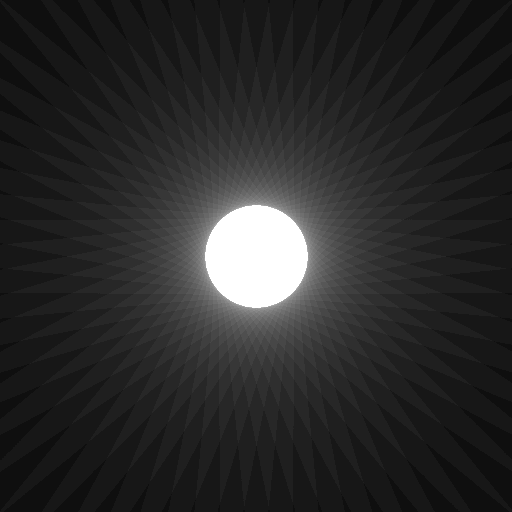

Jittered sampling (64 samples per pixel):

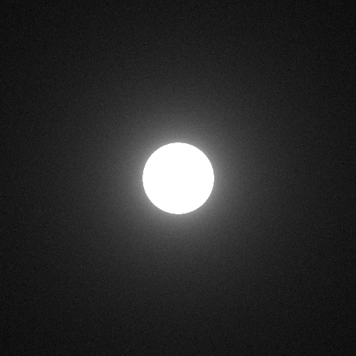

Various sampling method side-by-side comparison (64 samples per pixel)::

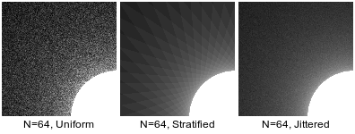

# Constructive Solid Geometry

Source code: [csg.c](csg.c)

Use union operation for creating multiple shapes:

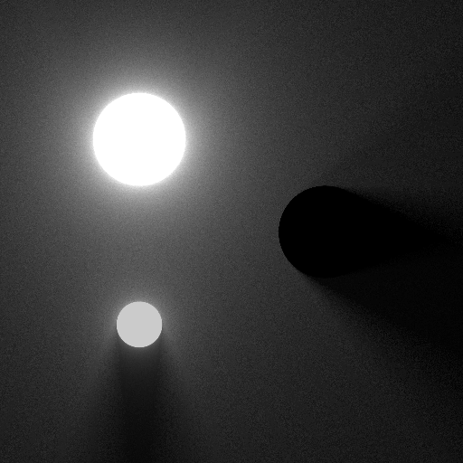

Various CSG operations on two circles:

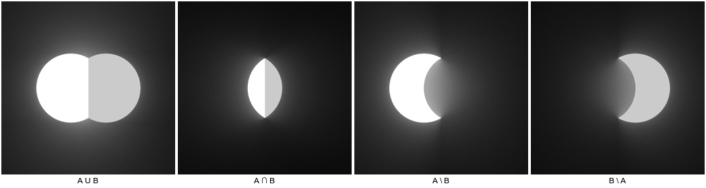

# Shapes

Source code: [shapes.c](shapes.c)

Examples of various shapes defined by SDF:

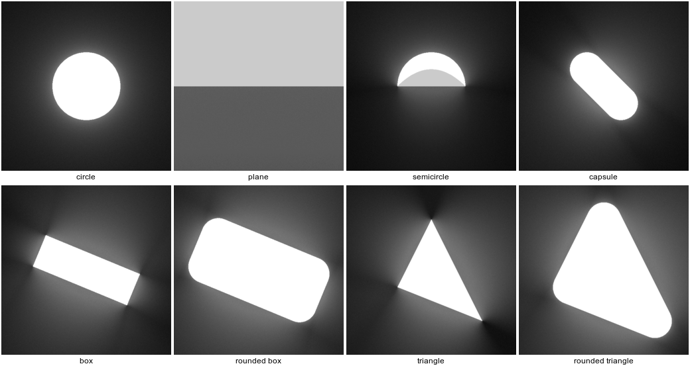

# Reflection

Source code: [reflection.c](reflection.c)

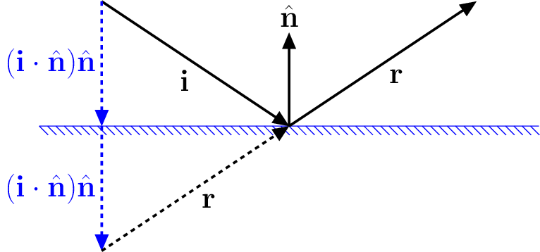

Test scene with two boxes:

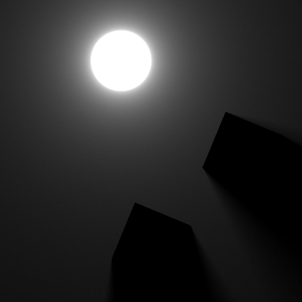

Visualization of SDF gradient, which is approximated by central difference:

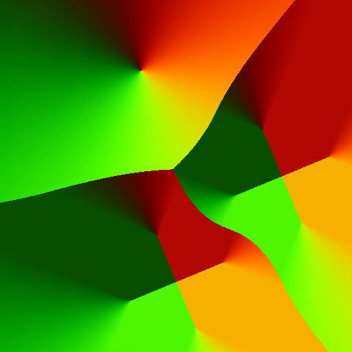

Reflection via recursive tracing:

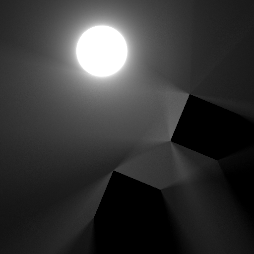

Concave mirror scene generates caustics effect:

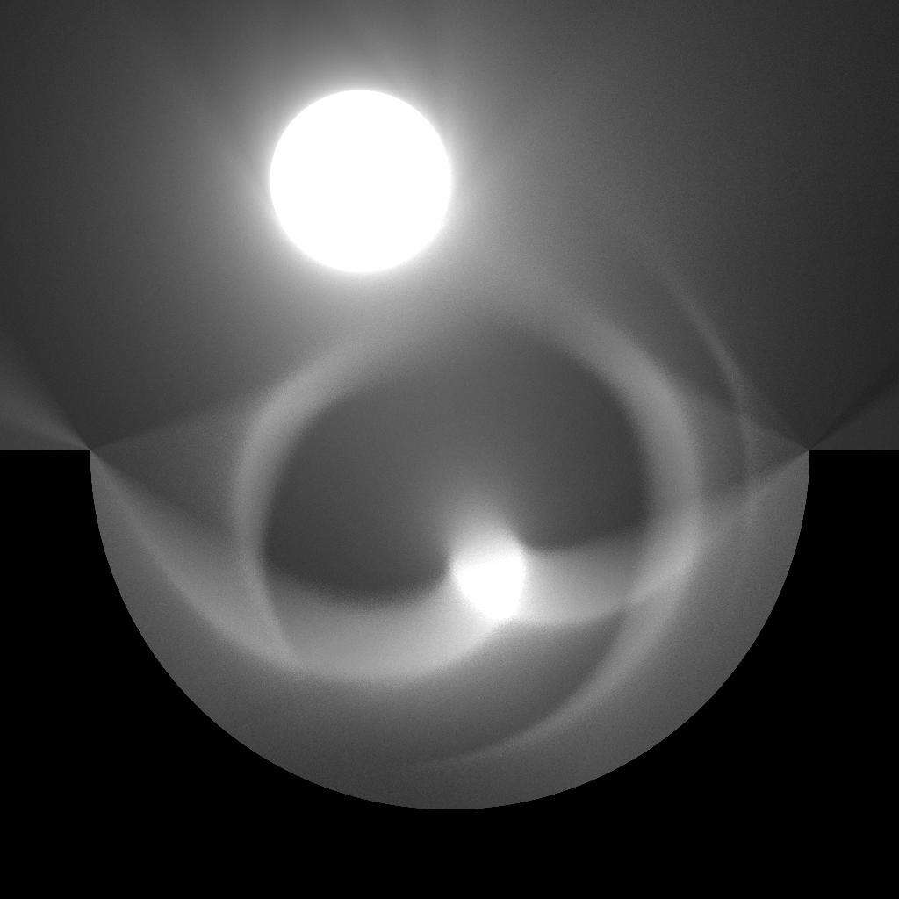

# Refraction

Source code: [refraction.c](refraction.c)

Applying Snell's law to compute refraction direction. Total internal reflection is also handled.

Test scenes:

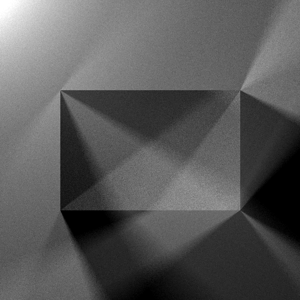

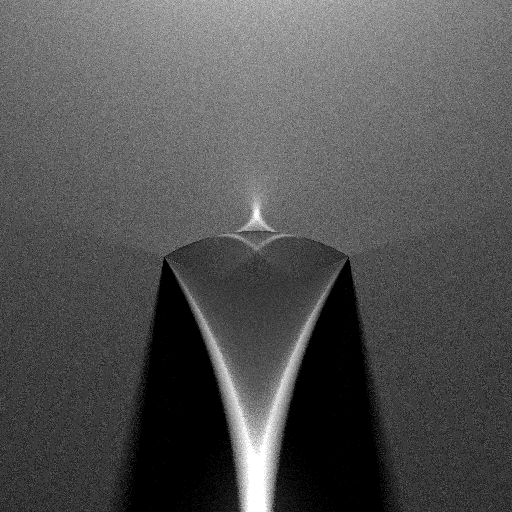

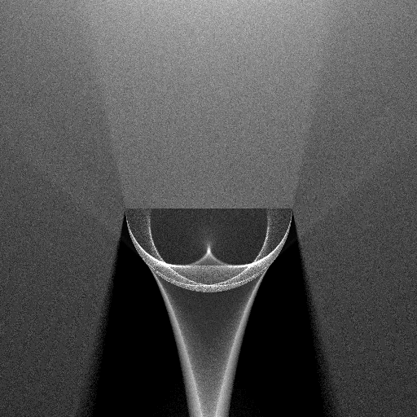

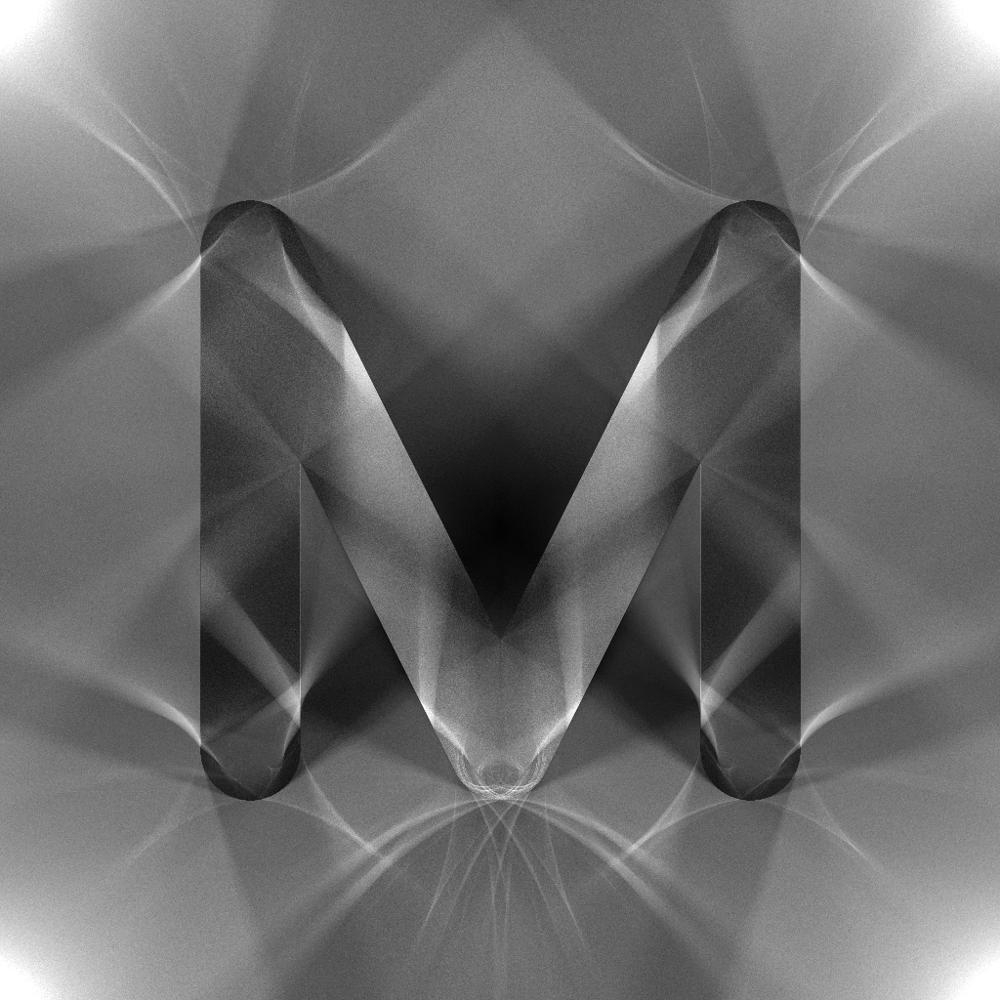

# Fresnel Reflectance

Source code: [fresnel.c](fresnel.c)

Applying Fresnel equation to compute reflectance of dielectric medium.

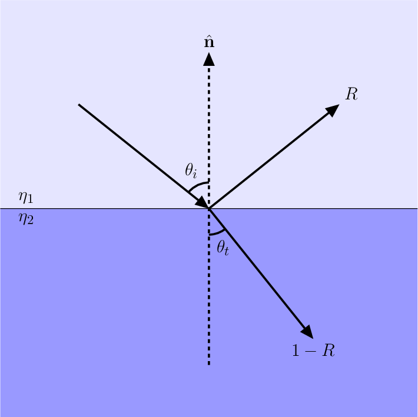

Without Fresnel:

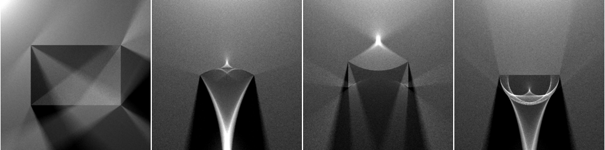

With Fresnel term:

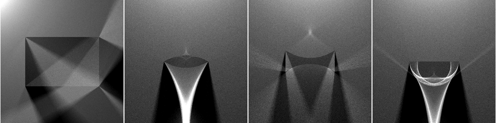

# Beer-Lambert

Source code: [beerlambert.c](beerlambert.c) [beerlambert_color.c](beerlambert_color.c)

Applying Beer-Lambert law to simulate absorption of light in medimum.

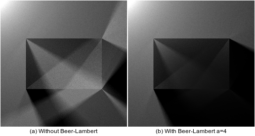

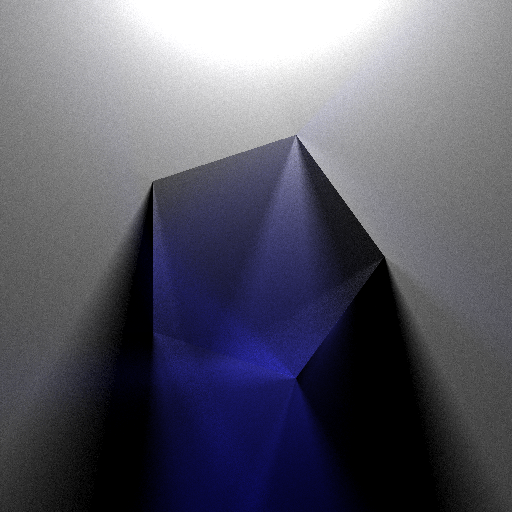

